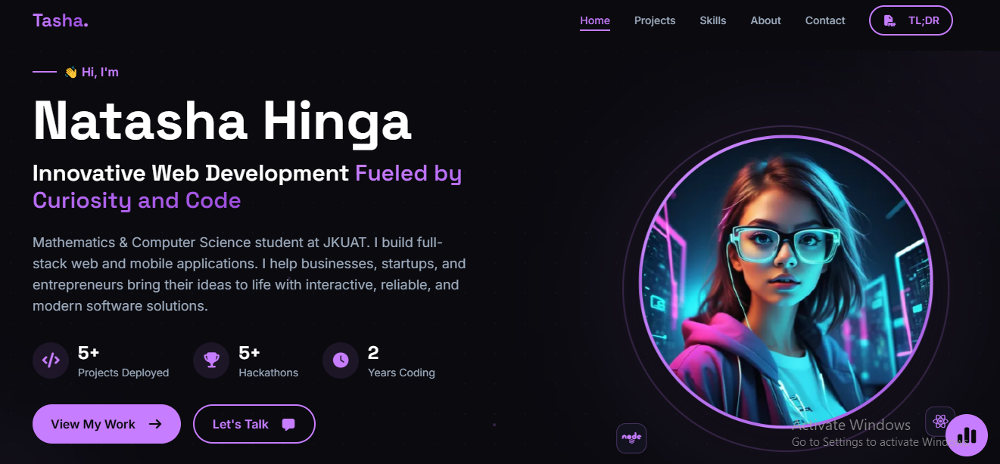
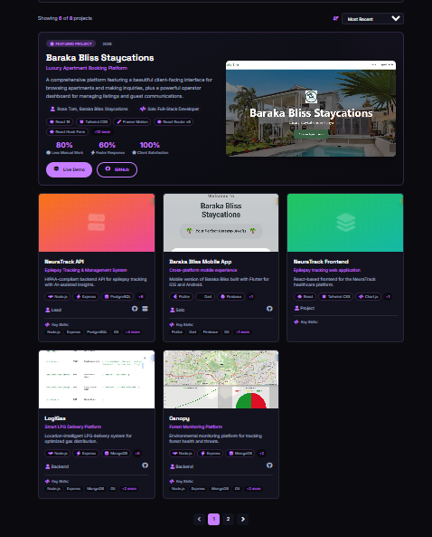
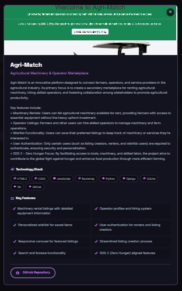
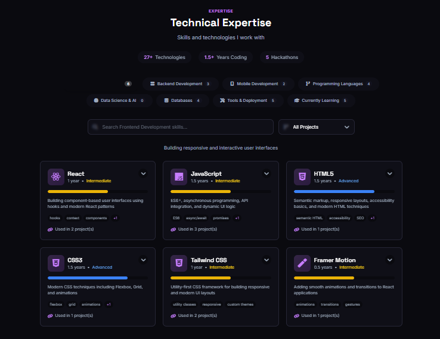
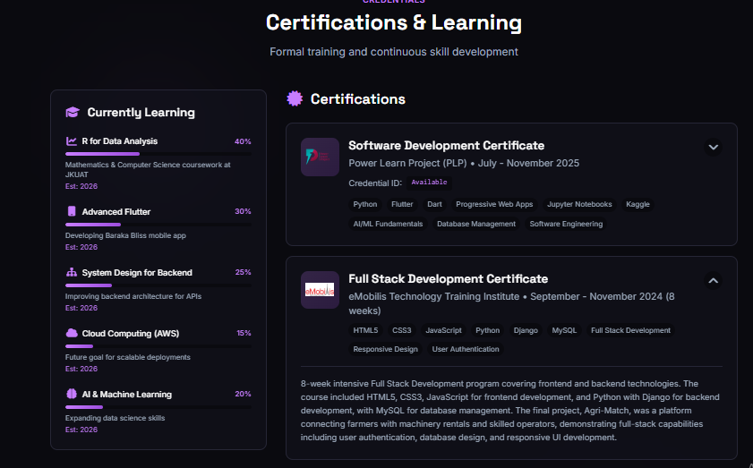
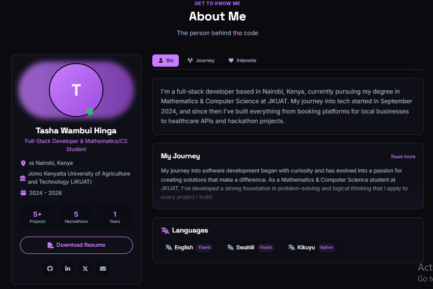
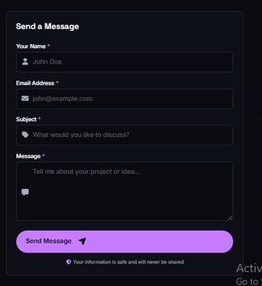
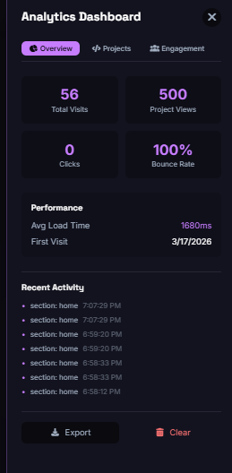
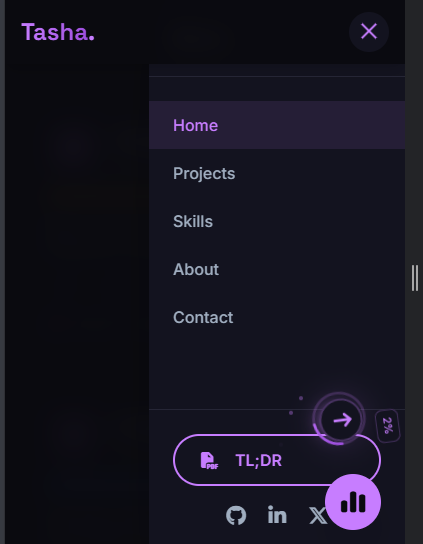

# 🎉 Natasha Hinga's Dev Portfolio

<div align="center">
  
  
  
  
  
  

  <h3>✨ Mathematics & CS Student | Full-Stack Developer | Curious Human ✨</h3>
  
  [🌐 Live Demo](https://natashahinga.vercel.app) • 
  [🐙 GitHub](https://github.com/slate299) • 
  [💼 LinkedIn](https://linkedin.com/in/natasha-hinga-a2b268337) • 
  [🐦 Twitter](https://x.com/HingaNatas39546)
  
  
</div>

## 📸 **Sneak Peek**

<div align="center">
  
  *Your portfolio is so good, it should come with a warning label!* ⚠️
  
  | | |
  |:---:|:---:|
  | **Hero Section** | **Projects Grid** |
  |  |  |
  | **Projects Modal** | **Skills Section** |
  |  |  |
  | **Certifications Modal** | **About Section** |
  |  |  |
  | **Contact Form** | **Analytics Dashboard** |
  |  |  |
  | **Mobile View** |
  |  |

</div>

## 🚀 **What's This All About?**

Hey there! 👋 Welcome to the digital garden where I, Natasha Hinga, plant my code seeds and watch them grow into beautiful web applications. This portfolio isn't just another "Hello World" – it's the story of a Mathematics & Computer Science student who fell in love with building things for the web.

Built with **React**, powered by **curiosity**, and styled with **purple dreams** 💜

## ✨ **Features That'll Make You Go "Whoa!"**

### 🎨 **Look & Feel**

- **Dark theme with neon purple accents** – Because dark mode is life 🌙
- **Smooth animations** – Butter-smooth transitions that'll make you want to scroll forever
- **Fully responsive** – Looks 🔥 on your phone, tablet, and that 4K monitor you definitely need
- **Custom favicon** – Even the browser tab is branded!

### 📁 **Projects Section** (The Good Stuff)

- **8+ projects** including client work, hackathons, and "oops-this-took-longer-than-expected" moments
- **Advanced filtering** – Search by tech, category, or your intuition
- **Project modals** – Click any card to dive deep into the details
- **Skill badges** – See exactly what tech went into each project
- **Analytics tracking** – Yes, I know you clicked that 👀

### 🛠️ **Skills & Certifications** (The "I Actually Know Things" Section)

- **30+ technologies** across frontend, backend, mobile, and data science
- **Visual proficiency bars** – Because percentages are fun!
- **PLP Software Development Certificate** (with actual certificate image – click to zoom!)
- **eMobilis Full Stack Certificate** (coming soon to a portfolio near you)
- **Currently learning** R, Advanced Flutter, System Design – never stop learning!

### 📊 **Fun Stats** (Because Numbers are Cool)

- ⏰ Coding since: September 2024
- 📈 Years active: 1.5+
- 🚀 Total projects: 8
- 🏆 Hackathons: 5
- ☕ Coffee consumed: ☕☕☕☕☕ (this is probably inaccurate – it's more)

### 📱 **Interactive Features**

- **Back to Top button** with progress ring – because scrolling is exhausting
- **Analytics dashboard** – See what visitors are checking out
- **Newsletter signup** – Get updates when I build cool stuff
- **Contact form** with validation – No spam, only genuine human connection
- **Print-friendly styles** – For when you need a paper backup

## 🛠️ **Built With** (The Tech Stack Flex)

| Category               | Technologies                                          |
| ---------------------- | ----------------------------------------------------- |
| **Frontend**           | React 18, Tailwind CSS, Framer Motion, React Router   |
| **Backend (projects)** | Node.js, Express, Python, Django, MongoDB, PostgreSQL |
| **Mobile**             | Flutter, Dart, Firebase (in progress)                 |
| **Data Science**       | Jupyter Notebooks, Kaggle, Pandas (Python)            |
| **Tools**              | Git, GitHub, Vercel, Render, Postman                  |
| **Analytics**          | Custom-built tracking (yes, I made my own!)           |

## 🏗️ **Project Structure** (For the Curious)

```
portfolio/
├── public/                 # Static assets
│   ├── certificates/       # Certificate images (click to zoom!)
│   ├── images/             # Project screenshots
│   └── resume.pdf          # My life on one page
├── src/
│   ├── components/         # All the building blocks
│   │   ├── about/          # Bio, journey, fun facts
│   │   ├── common/         # BackToTop, PageTransition, etc.
│   │   ├── contact/        # Form with validation
│   │   ├── hero/           # First impressions matter
│   │   ├── navbar/         # Navigate the chaos
│   │   ├── newsletter/     # Join the cool kids club
│   │   ├── projects/       # The main attraction
│   │   └── skills/         # Flex zone
│   ├── data/               # All content (easy to update!)
│   ├── hooks/              # Custom React hooks
│   ├── styles/             # CSS files (yes, some CSS survived)
│   ├── utils/              # Analytics, performance, etc.
│   └── App.jsx             # Where the magic happens
```

## 🚀 **Getting Started** (Run It Locally)

```bash
# Clone this bad boy
git clone https://github.com/slate299/tasha-portfolio.git

# Enter the matrix
cd tasha-portfolio

# Install dependencies (go grab a coffee ☕)
npm install

# Fire it up!
npm run dev

# Your new favorite site is at http://localhost:5173
```

## 🔧 **Environment Variables** (Secret Stuff)

Create a `.env` file for local development:

```env
VITE_FORMSPREE_ENDPOINT=your_formspree_endpoint
VITE_BUTTONDOWN_API_KEY=your_buttondown_api_key  # For newsletter magic
```

## 📦 **Building for Production**

```bash
# Build the thing
npm run build

# Preview it locally
npm run preview

# Deploy to Vercel (my personal fav)
vercel --prod
```

## 🎯 **Roadmap** (What's Cooking?)

- [ ] **Blog section** – Because I have thoughts to share
- [ ] **More project case studies** – Deep dives into the good stuff
- [ ] **Dark/light mode toggle** (okay, maybe I'll add it back)
- [ ] **Actually finish the Flutter app** (it's 70% done, I swear!)
- [ ] **Add more hackathon projects** – They're piling up!

## 🙏 **Shoutouts & Acknowledgments**
- **You** – For checking out my code. High five! ✋

## 📬 **Let's Connect!**

I'm always down for:

- 🤝 Collaborations on cool projects
- 💡 Brainstorming ideas
- 🎤 Speaking opportunities
- ☕ Virtual coffee chats
- 💼 Job opportunities (hint hint)

<div align="center">
  
[](mailto:natashahinga58@gmail.com)
[](https://github.com/slate299)
[](https://linkedin.com/in/natasha-hinga-a2b268337)
[](https://x.com/HingaNatas39546)

</div>

---

<div align="center">
  
**Made with 💜, ☕**


**If you've read this far, you're awesome. Now go build something cool!** 🚀

</div>
